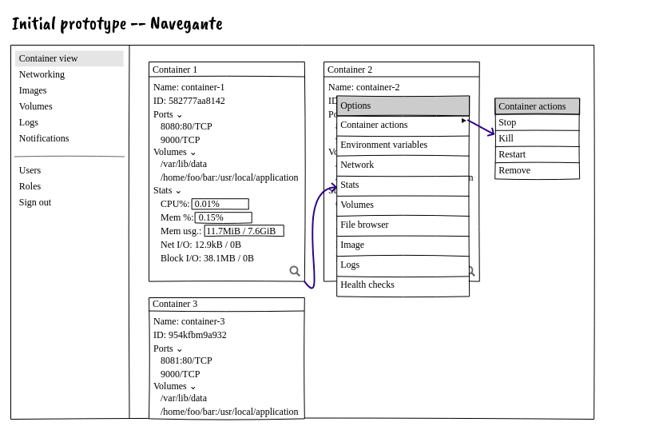
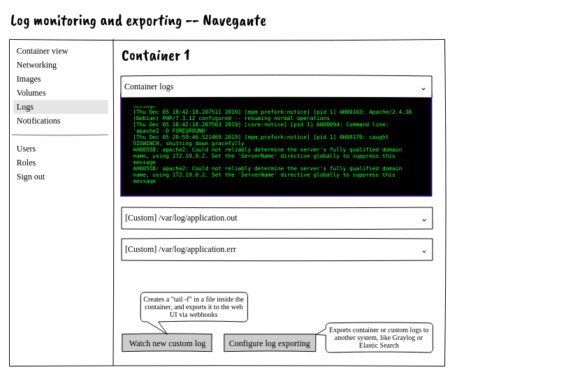
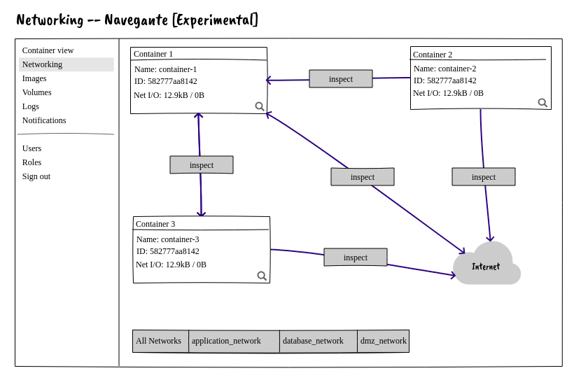

# Navegante

Navegante is a work-in-progress tool that aims to monitor and observe containers running on a Docker host. It is written in Golang, and follows some of the Clean Architecture principles.

Some of the planned features are:

- Viewing containers executed in the host, showing exposed ports, volumes and stats;
- Executing actions in the containers (run, start, stop, kill);
- Showing container logs, with the possibility to monitor files inside the containers;
- Exposing container and custom logs to an external applications such as Graylog and Logstash;
- Network traffic monitoring (This is a very conceptual idea that still needs validation)

## Architecture

The application is being designed to run in three tiers, with a back-end (REST API), a front-end (web UI) and a webhook server. I am still deciding if it will need a database tier, but if it needs it's probably going to be something like SQLite.

My idea is to run everything in a single container, to make things more organized, but I might separate it in two or three images, if the need arises.

## Screen prototypes

Here are a couple of screen prototypes to demonstrate the planned web UI for the system.

##### Main Screen

##### Log monitoring and exporting screen

##### (Experimental) Network monitoring screen

## Future

The application is being designed to isolate the container API calls with `containergateway`. The goal with this is to allow to use other container platforms and schedulers besides Docker. Some of the planned features are:

- Docker Swarm integration. I believe this would be the next logical step since the Docker integration by itself application might not be very useful when running on a single Docker host.
- Kubernetes integration. Since I believe Kubernetes is more popular at the moment, this would make the tool useful for more people. Although I believe there might be better tools for observing Kubernetes clusters.
